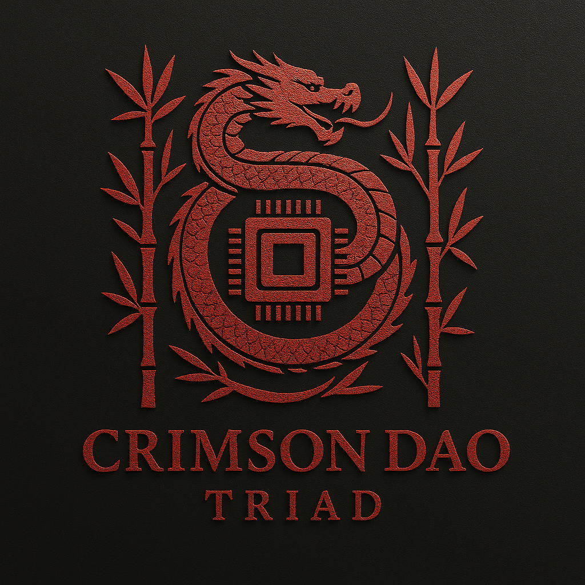
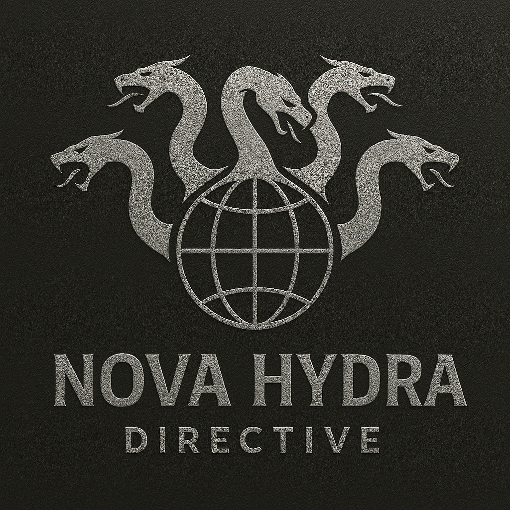

# 🕵️ Enemy Factions

The world of *Rainbow Six: Strategic Ops* is filled with hostile entities, each with unique tactics, goals, and terrain specialties.

---

## 🔺 Crimson Dao Triad  

A hyper-violent criminal cartel dealing in weapons, biotech, and global smuggling.  
**Tactics:** Ambush, urban control  
**Terrain:** Urban, Underground  

---

## ❄️ Arktikos Valkyries  

A rogue militia of arctic-trained soldiers with cryogenic warfare systems.  
**Tactics:** Defensive, long-range  
**Terrain:** Arctic, Mountain  

---

## 🛰️ Nova Hydra Directive  

A Cold War relic operating in shadows through satellites and sleeper agents.  
**Tactics:** AI warfare, blacksite raids  
**Terrain:** Underground, All  

---

### 🔍 Coming Soon

More factions will be revealed as your campaign expands...
