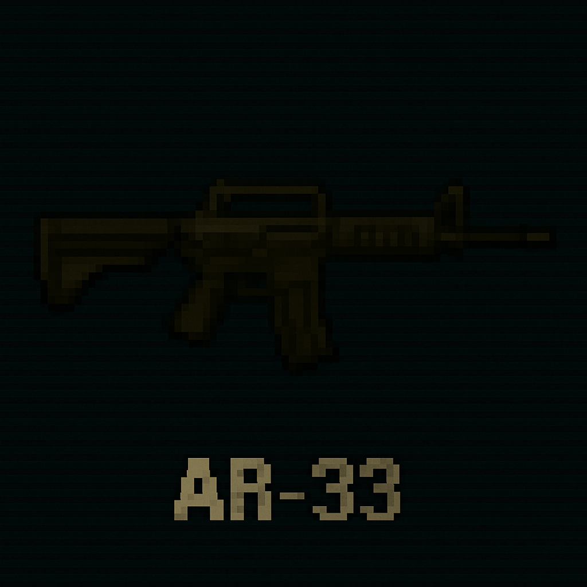
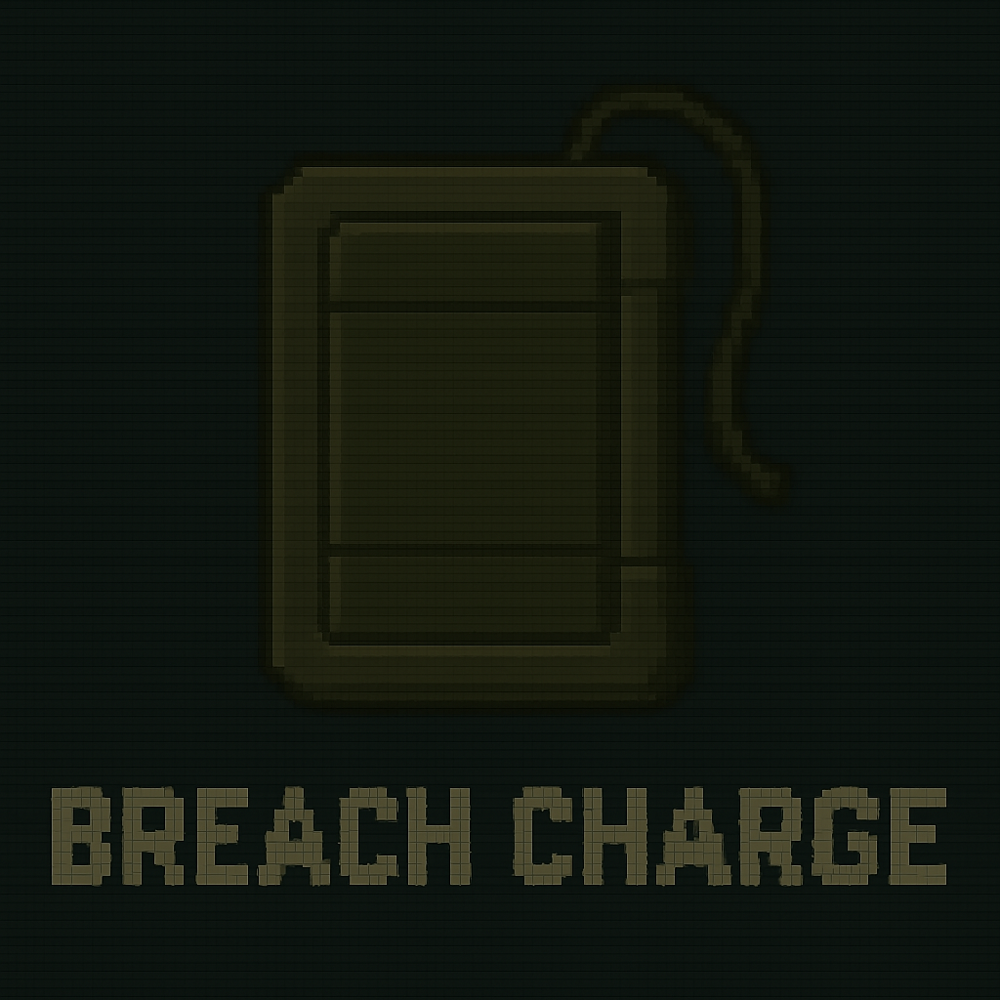
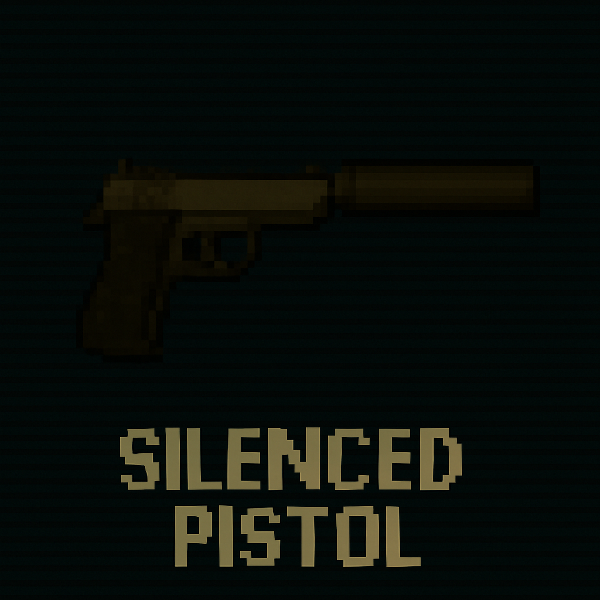
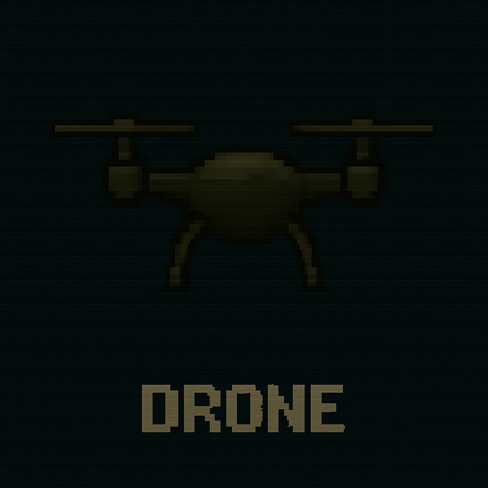

# 🧰 Gear Catalog

Operators rely on specialized gear to succeed in the field. Here's a breakdown of weapons, gadgets, and utilities used across missions.

---

## 🔫 AR-33  

**Type:** Primary  
**Damage:** 8  
**Noise:** 6  
**Weight:** 1  
**Rarity:** Common  
A reliable assault rifle for mid-range engagements.  

---

## 🔧 Breach Charge  

**Type:** Utility  
**Effect:** Force entry  
**Noise:** 10  
**Weight:** 1  
**Rarity:** Common  
Used to breach reinforced doors and walls. Loud but effective.  

---

## 🤫 Silenced Pistol  

**Type:** Sidearm  
**Damage:** 4  
**Noise:** 2  
**Weight:** 1  
**Rarity:** Common  
Perfect for stealth operations. Low damage, but nearly silent.  

---

## 🛠️ Mini Drone  

**Type:** Gadget  
**Effect:** Reveal enemies  
**Weight:** 1  
**Rarity:** Common  
Deploys a small drone to scout terrain and spot hostiles.  

